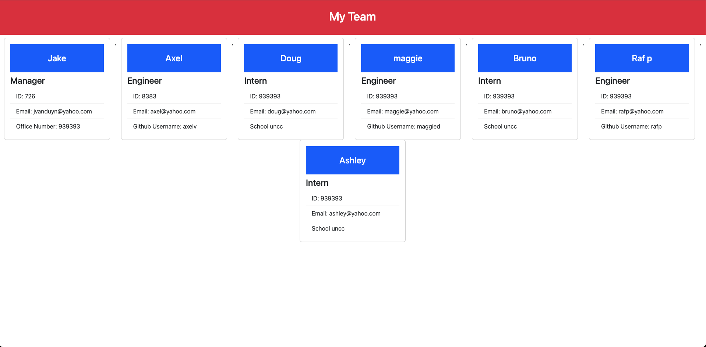

  # TeamProfileGenerator

  

  ## Description
  
  This project was a test of my use of Node, Javascript, and Object Oriented Programming. I wanted to create this project to be able to show that I would be able to use test driven development, as well as be able to use multiple classes and subclasses to sort through data. From there I am using multiple functions that are using template literals to create a page with multiple cards.During this project, the user will need to input information regarding their team. There will be 3 types of team members and different questions it asks you based off which type of team member. This will collect all of the data to be pushed into an HTML file. The user can input as many Engineers, and Interns as they would like as there is no limit. 

  

  
  
  ## Table of Contents
  
  - [Installation](#installation)
  - [Usage](#usage)
  - [License](#license)
  - [Contributing](#contributing)
  - [Tests](#tests)
  - [Contact](#contact)
  
  ## Installation
  
  In order to install this project, you will need to enter the integrated terminal for the index.js file. From there, you will type the following commands. "npm i -y", this will install your dependencies. "node index.js", this will start the prompt for the user to be able to input their teams information. When they are finished they will need to select "I do not have any more team members to add" for the prompt to stop. 

  If you would like to see more, please view the youtube video below of the funcitoning application. 
  
  ## Usage
  
  The user will need to input into the integrated terminal the following command "node index.js", this will start the prompt for the user to be able to input their teams information. When they are finished they will need to select "I do not have any more team members to add" for the prompt to stop. Once finished, there will be an "index.html" file that will be under the folder "dist". From there they can open the file in their browser in order to see all of the stored data on the page. 
  
  ## License

  This project is licensed under:https://opensource.org/licenses/MIT
  
  ## Badges
  
    
  ## Contributing
  
  In order to contribute to this projet, I just ask that they give me some sort of credits on their readme file and please let me know if there was any contributions made. 

  ## Tests
  
  In order to run the tests to make sure that the inputs meet the requirements, the user would type in the integrated terminal "npm test"

  ## Contact

  You can view my github at https://www.github.com/jvanduyn.
  You can email me at jcvanduyn@yahoo.com.